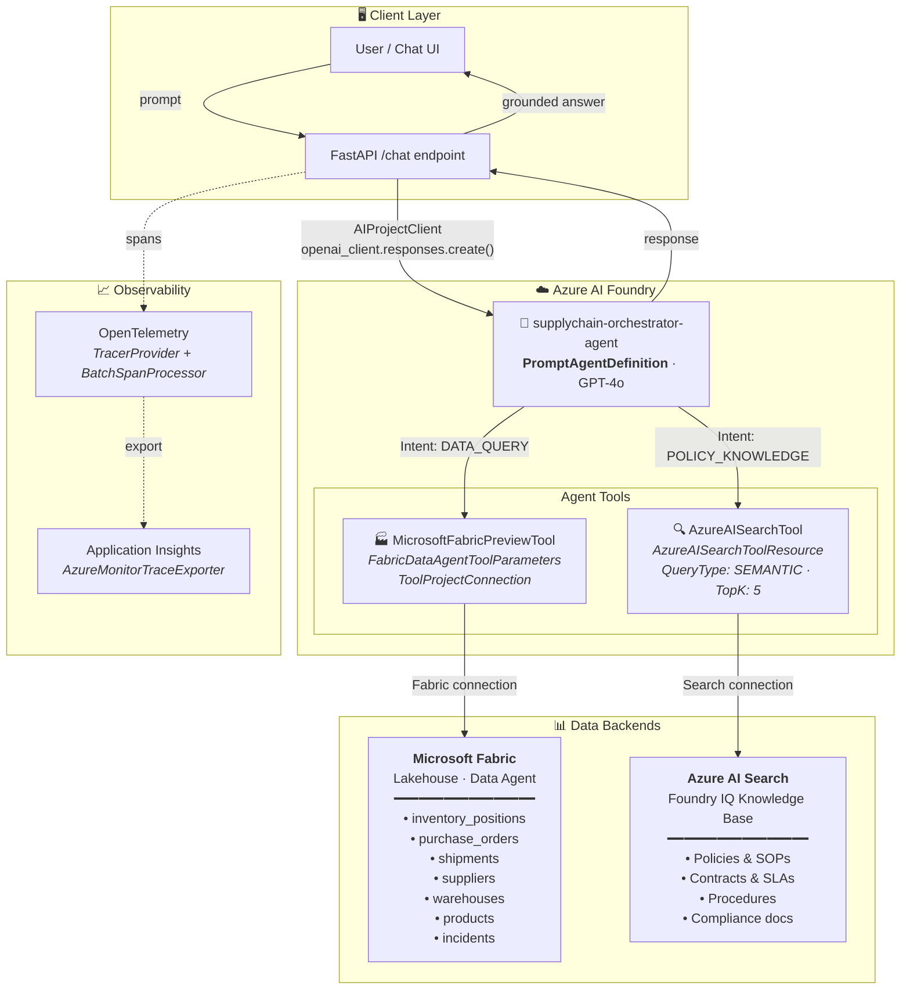
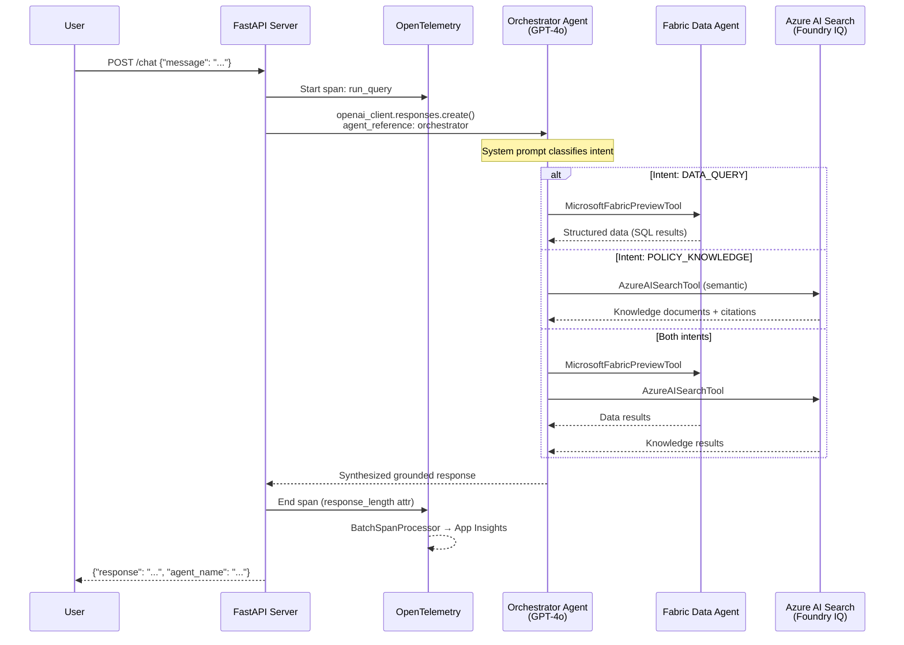
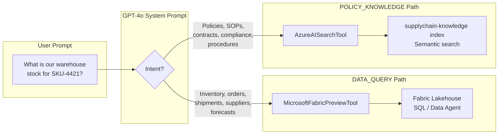
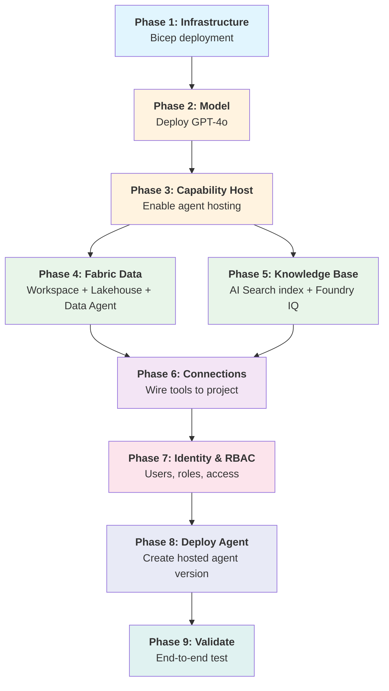
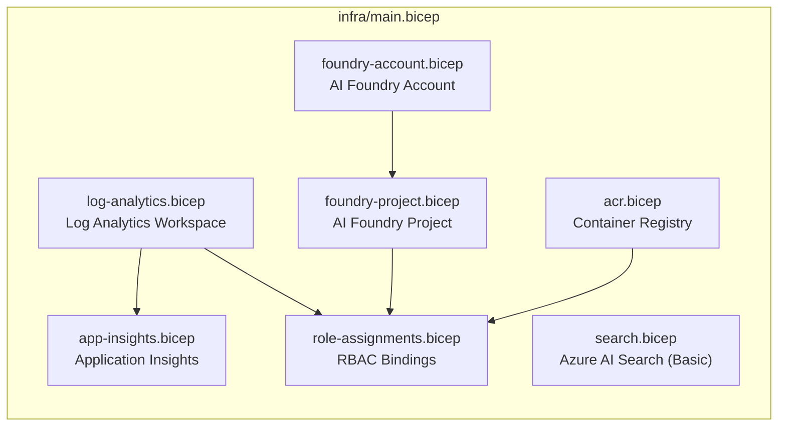
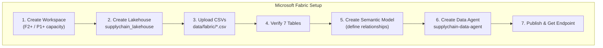
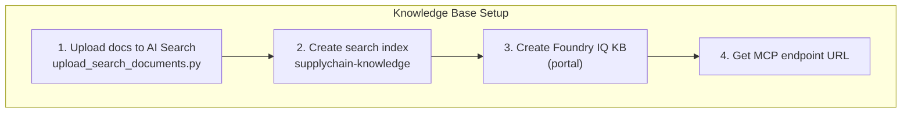
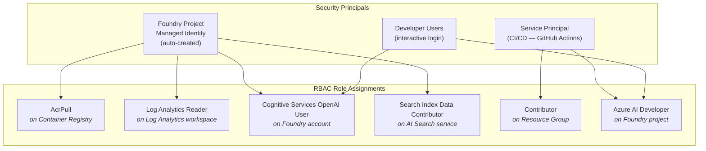
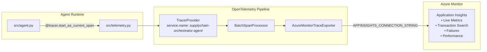

# 🔗 Agentic Supply Chain Orchestrator v2

An end-to-end **agentic supply-chain orchestrator** built on **Azure AI Foundry**, combining intent-based routing, governed structured data via **Microsoft Fabric**, and grounded knowledge retrieval via **Azure AI Search (Foundry IQ)**.

---

## 🏗️ Architecture



---

## 🔄 Request Flow



---

## 🧠 Intent Classification



---

## 📦 SDK Classes

| Class | Package | Purpose |
|-------|---------|---------|
| `AIProjectClient` | `azure.ai.projects` | Entry point — manages Foundry project, connections, agents |
| `PromptAgentDefinition` | `azure.ai.projects.models` | Defines the hosted agent (model, instructions, tools) |
| `MicrosoftFabricPreviewTool` | `azure.ai.projects.models` | Routes data queries to the Fabric data agent |
| `FabricDataAgentToolParameters` | `azure.ai.projects.models` | Configures Fabric connection for the tool |
| `ToolProjectConnection` | `azure.ai.projects.models` | Binds a Foundry project connection to a tool |
| `AzureAISearchTool` | `azure.ai.projects.models` | Routes knowledge queries to Azure AI Search |
| `AzureAISearchToolResource` | `azure.ai.projects.models` | Defines search index configuration |
| `AzureAISearchQueryType` | `azure.ai.projects.models` | Query mode (`SEMANTIC`, `SIMPLE`, `VECTOR`) |
| `MCPTool` | `azure.ai.projects.models` | Alternative: route to remote MCP endpoint |
| `ConnectionType` | `azure.ai.projects.models` | Enum for connection types (`AZURE_AI_SEARCH`, etc.) |
| `DefaultAzureCredential` | `azure.identity` | Auth via CLI, managed identity, or service principal |
| `AzureMonitorTraceExporter` | `azure.monitor.opentelemetry.exporter` | Ships OpenTelemetry traces to App Insights |
| `TracerProvider` / `BatchSpanProcessor` | `opentelemetry.sdk.trace` | OpenTelemetry trace pipeline |

---

## 📂 Project Structure

```
agentic-supplychain-v2/
├── .env                        # Environment config (secrets, endpoints)
├── .gitignore
├── Dockerfile                  # Container image (Python 3.13 + FastAPI + Uvicorn)
├── requirements.txt            # Pinned Python dependencies
├── run.py                      # CLI entrypoint: python run.py
├── deploy.sh                   # One-command deploy to Foundry hosted agent
├── deploy_foundry_agent.py     # Programmatic agent version deployment
├── delete_agents.py            # Utility: list/delete agents and sessions
│
├── src/
│   ├── __init__.py
│   ├── config.py               # Settings dataclass loaded from .env
│   ├── telemetry.py            # OpenTelemetry → App Insights setup
│   ├── agent.py                # Core: creates agent, runs queries
│   ├── main.py                 # Interactive CLI loop
│   └── server.py               # FastAPI HTTP server (/chat, /health)
│
└── tests/
    └── __init__.py
```

---

## 🚀 Full Deployment Guide (End-to-End)

### Prerequisites

| Tool | Version | Install |
|------|---------|---------|
| Python | 3.11+ | `brew install python@3.11` or [python.org](https://python.org) |
| Azure CLI | 2.60+ | `brew install azure-cli` |
| Git | 2.x | `brew install git` |
| Docker | 24+ | [docker.com](https://docker.com) *(optional — container deploy)* |

**Azure requirements:**
- Azure subscription with **Contributor** + **User Access Administrator** roles
- Microsoft Entra ID tenant
- Microsoft Fabric capacity (**F2+** or **P1+**)

---

### Deployment Sequence



---

### Phase 1: Provision Azure Infrastructure

The `infra/` folder contains Bicep templates that deploy all Azure resources:



**Run:**
```bash
cd agentic-supplychain

# 1. Fill in your subscription/tenant IDs
cp .env.example .env && vim .env

# 2. Deploy everything (creates RG + all resources)
bash infra/scripts/bootstrap-env.sh

# 3. Export Bicep outputs to .env.generated
bash infra/scripts/export-deployment-outputs.sh
```

**What gets created:**
| Resource | Purpose | Bicep Module |
|----------|---------|--------------|
| AI Foundry Account | Parent account for projects | `foundry-account.bicep` |
| AI Foundry Project | Hosts agents, connections, models | `foundry-project.bicep` |
| Azure AI Search | Knowledge index backend | `search.bicep` |
| Container Registry | Docker images for API layer | `acr.bicep` |
| Application Insights | Telemetry & traces | `app-insights.bicep` |
| Log Analytics | Centralized logging | `log-analytics.bicep` |

---

### Phase 2: Deploy GPT-4o Model

> ⚠️ **Manual checkpoint** — model deployment requires portal interaction in most regions.

**Option A: Azure Portal (recommended)**
1. Go to [Azure AI Foundry](https://ai.azure.com) → your project
2. **Deployments** → **+ Create deployment**
3. Select **gpt-4o** → Standard deployment
4. Set TPM rate limit to **10K+**
5. Name: `gpt-4o`

**Option B: Azure CLI**
```bash
az cognitiveservices account deployment create \
  --name "$FOUNDRY_ACCOUNT_NAME" \
  --resource-group "$RESOURCE_GROUP_NAME" \
  --deployment-name "gpt-4o" \
  --model-name "gpt-4o" \
  --model-version "2024-08-06" \
  --model-format OpenAI \
  --sku-capacity 10 \
  --sku-name Standard
```

Update `.env`:
```bash
MODEL_DEPLOYMENT_NAME=gpt-4o
```

---

### Phase 3: Enable Capability Host

Required before any hosted agent can be deployed:

```bash
bash infra/scripts/postprovision-capability-host.sh
```

This calls the preview API to create an "Agents" capability host with public hosting. If the script fails, follow the portal fallback:
1. Azure Portal → AI Foundry account → **Settings** → **Capability Host**
2. Enable **Agents** capability with public hosting
3. Save and wait for provisioning

---

### Phase 4: Microsoft Fabric – Workspace, Data & Agent

> ⚠️ **Manual checkpoint** — Fabric setup is portal-driven.



#### Step-by-step:

1. **Create Workspace** — Go to [fabric.microsoft.com](https://app.fabric.microsoft.com) → New workspace backed by F2+/P1+ capacity

2. **Create Lakehouse** — In workspace: **+ New** → **Lakehouse** → name: `supplychain_lakehouse`

3. **Upload CSVs** — Upload all 7 files from `data/fabric/`:
   | File | Records | Description |
   |------|---------|-------------|
   | `suppliers.csv` | 10 | Supplier master data |
   | `products.csv` | 12 | Product catalog |
   | `purchase_orders.csv` | 15 | Open/closed purchase orders |
   | `shipments.csv` | 11 | In-transit and delivered |
   | `inventory_positions.csv` | 12 | Stock by warehouse/SKU |
   | `warehouses.csv` | 4 | Warehouse locations |
   | `incidents.csv` | 7 | Disruption events |

4. **Verify Tables** — Confirm all 7 tables load correctly in Lakehouse Explorer

5. **Create Semantic Model** (ontology) — Select all tables and define relationships:
   ```
   suppliers.supplier_id  ──→  purchase_orders.supplier_id
   products.product_id    ──→  purchase_orders.product_id
   purchase_orders.po_id  ──→  shipments.po_id
   products.product_id    ──→  inventory_positions.product_id
   warehouses.warehouse_id──→  inventory_positions.warehouse_id
   suppliers.supplier_id  ──→  incidents.supplier_id
   ```

6. **Create Data Agent** — In workspace: **+ New** → **Data Agent** (preview)
   - Name: `supplychain-data-agent`
   - Data source: the Lakehouse or semantic model
   - Enable natural language queries, include all tables
   - **Test**: *"Which suppliers have the highest delay rates?"*
   - **Publish** the agent

7. **Copy endpoint URL** → set `FABRIC_DATA_AGENT_ENDPOINT` in `.env`

---

### Phase 5: Knowledge Base – Azure AI Search + Foundry IQ



#### Step-by-step:

1. **Upload knowledge documents** to Azure AI Search:
   ```bash
   cd agentic-supplychain
   python scripts/upload_search_documents.py
   ```
   This indexes 8 markdown files from `data/knowledge/`:
   - **Policies**: alternate supplier approval, expedited shipping, supplier escalation
   - **Procedures**: shortage response playbook, warehouse receiving SOP
   - **Contracts**: Apex master agreement, Delta Components terms, NorthStar logistics SLA

2. **Create Foundry IQ Knowledge Base** (portal):
   - Go to [ai.azure.com](https://ai.azure.com) → your project → **Knowledge Bases** → **+ New**
   - Name: `supplychain-knowledge`
   - Connect to your Azure AI Search service
   - Select index: `supplychain-knowledge`
   - Map fields: content → `content`, title → `title`, category → `category`
   - Save and test: *"What are the penalty terms for late deliveries?"*

3. **Copy the MCP endpoint URL** → set `FOUNDRY_IQ_MCP_URL` in `.env`

---

### Phase 6: Create Foundry Project Connections

Wire the Fabric data agent and Search service as connections the orchestrator can use:

```bash
python infra/scripts/create-foundry-connections.py
```

This creates (or guides you through portal creation of):

| Connection Name | Type | Target |
|-----------------|------|--------|
| `supplychain-data-agent` | RemoteTool | Fabric data agent endpoint |
| `foundry-iq-mcp` | RemoteTool | Foundry IQ MCP endpoint |
| `acr-connection` | ContainerRegistry | ACR login server |
| `appinsights-connection` | ApplicationInsights | App Insights connection string |

If the SDK call fails, the script prints exact portal instructions:
> Azure AI Foundry → Project → **Settings** → **Connections** → **+ New Connection**

---

### Phase 7: Identity Management & RBAC



#### Automated roles (deployed via Bicep):

The `role-assignments.bicep` module automatically grants the Foundry project managed identity:
- **AcrPull** on the Container Registry (pull agent images)
- **Log Analytics Reader** on the Log Analytics workspace

#### Additional roles you must assign:

```bash
# Get the Foundry project managed identity principal ID
PROJECT_PRINCIPAL_ID=$(az deployment group show \
  --resource-group "$RESOURCE_GROUP_NAME" --name main \
  --query "properties.outputs.projectPrincipalId.value" -o tsv)

# 1. Allow the managed identity to call GPT-4o
az role assignment create \
  --assignee "$PROJECT_PRINCIPAL_ID" \
  --role "Cognitive Services OpenAI User" \
  --scope "/subscriptions/$AZURE_SUBSCRIPTION_ID/resourceGroups/$RESOURCE_GROUP_NAME/providers/Microsoft.CognitiveServices/accounts/$FOUNDRY_ACCOUNT_NAME"

# 2. Allow the managed identity to query AI Search
az role assignment create \
  --assignee "$PROJECT_PRINCIPAL_ID" \
  --role "Search Index Data Contributor" \
  --scope "/subscriptions/$AZURE_SUBSCRIPTION_ID/resourceGroups/$RESOURCE_GROUP_NAME/providers/Microsoft.Search/searchServices/$SEARCH_SERVICE_NAME"
```

#### Grant developer/user access:

```bash
# Add a developer to the Foundry project (interactive agent testing)
az role assignment create \
  --assignee "user@contoso.com" \
  --role "Azure AI Developer" \
  --scope "/subscriptions/$AZURE_SUBSCRIPTION_ID/resourceGroups/$RESOURCE_GROUP_NAME/providers/Microsoft.CognitiveServices/accounts/$FOUNDRY_ACCOUNT_NAME"

# Allow developers to use GPT-4o models
az role assignment create \
  --assignee "user@contoso.com" \
  --role "Cognitive Services OpenAI User" \
  --scope "/subscriptions/$AZURE_SUBSCRIPTION_ID/resourceGroups/$RESOURCE_GROUP_NAME/providers/Microsoft.CognitiveServices/accounts/$FOUNDRY_ACCOUNT_NAME"
```

#### Grant CI/CD service principal access:

```bash
# Service principal for GitHub Actions (OIDC federation)
az role assignment create \
  --assignee "$AZURE_CLIENT_ID" \
  --role "Contributor" \
  --scope "/subscriptions/$AZURE_SUBSCRIPTION_ID/resourceGroups/$RESOURCE_GROUP_NAME"

az role assignment create \
  --assignee "$AZURE_CLIENT_ID" \
  --role "Azure AI Developer" \
  --scope "/subscriptions/$AZURE_SUBSCRIPTION_ID/resourceGroups/$RESOURCE_GROUP_NAME/providers/Microsoft.CognitiveServices/accounts/$FOUNDRY_ACCOUNT_NAME"
```

#### Fabric access:

In the Fabric portal, share the data agent and underlying Lakehouse:
1. Open the Fabric workspace → **Manage access**
2. Add users/groups with **Contributor** or **Viewer** role
3. Share the data agent explicitly (data agent access ≠ workspace access)

#### Summary of all required roles:

| Principal | Role | Scope | Purpose |
|-----------|------|-------|---------|
| Foundry Project MI | AcrPull | Container Registry | Pull images |
| Foundry Project MI | Log Analytics Reader | Log Analytics | Read telemetry |
| Foundry Project MI | Cognitive Services OpenAI User | Foundry Account | Call GPT-4o |
| Foundry Project MI | Search Index Data Contributor | AI Search | Query index |
| Developer User | Azure AI Developer | Foundry Account | Test agents |
| Developer User | Cognitive Services OpenAI User | Foundry Account | Use models |
| CI/CD Service Principal | Contributor | Resource Group | Deploy infra |
| CI/CD Service Principal | Azure AI Developer | Foundry Account | Deploy agents |

---

### Phase 8: Deploy the Orchestrator Agent

```bash
cd agentic-supplychain-v2

# Deploy hosted agent version to Foundry
./deploy.sh

# Or with options
python deploy_foundry_agent.py \
  --agent-name supplychain-orchestrator-agent-v2 \
  --prune-old-versions --keep 3
```

---

### Phase 9: Validate End-to-End

```bash
# Run locally against the deployed agent
python run.py
```

Test queries:
| Query | Expected Tool | Expected Source |
|-------|--------------|----------------|
| *"What inventory do we have in the Northeast warehouse?"* | Fabric | `inventory_positions` table |
| *"What is our expedited shipping policy?"* | AI Search | `expedited_shipping_policy.md` |
| *"Which suppliers are flagged for escalation and what's the procedure?"* | Both | `suppliers` + `supplier_escalation_runbook.md` |

---

## 🚀 Quick Start (Local — after all Azure resources are provisioned)

```bash
# 1. Clone
git clone https://github.com/chtrembl/azure-cloud.git
cd azure-cloud/agentic-supplychain-v2

# 2. Virtual environment
python3.11 -m venv .venv && source .venv/bin/activate
pip install -r requirements.txt

# 3. Authenticate
az login && az account set --subscription $AZURE_SUBSCRIPTION_ID

# 4. Run interactive CLI
python run.py

# 5. Or run as HTTP server
pip install fastapi "uvicorn[standard]" pydantic
uvicorn src.server:app --host 0.0.0.0 --port 8080 --reload
```

Test the API:
```bash
curl http://localhost:8080/health

curl -X POST http://localhost:8080/chat \
  -H "Content-Type: application/json" \
  -d '{"message": "What is our expedited shipping policy?"}'
```

---

## 📊 Observability



**Traced spans:**
- `create_orchestrator_agent` — agent provisioning latency
- `run_query` — per-query latency, with attributes: `user_message`, `response_length`

---

## 🔑 Environment Variables

| Variable | Description | Source |
|----------|-------------|--------|
| `AZURE_SUBSCRIPTION_ID` | Azure subscription | Azure Portal |
| `AZURE_TENANT_ID` | Entra ID tenant | Azure Portal |
| `AZURE_CLIENT_ID` | Service principal (CI/CD) | App Registration |
| `AZURE_LOCATION` | Region (e.g. `swedencentral`) | — |
| `RESOURCE_GROUP_NAME` | Resource group | Phase 1 |
| `FOUNDRY_ACCOUNT_NAME` | AI Foundry account name | Phase 1 output |
| `AZURE_AI_PROJECT_ENDPOINT` | Foundry project endpoint | Phase 1 output |
| `MODEL_DEPLOYMENT_NAME` | GPT-4o deployment | Phase 2 |
| `SEARCH_ENDPOINT` | AI Search URL | Phase 1 output |
| `SEARCH_SERVICE_NAME` | AI Search service name | Phase 1 output |
| `FABRIC_WORKSPACE_NAME` | Fabric workspace | Phase 4 |
| `FABRIC_DATA_AGENT_ENDPOINT` | Fabric data agent URL | Phase 4, step 7 |
| `FOUNDRY_IQ_MCP_URL` | Knowledge base MCP URL | Phase 5, step 3 |
| `APPINSIGHTS_CONNECTION_STRING` | Telemetry connection | Phase 1 output |
| `ACR_NAME` | Container Registry name | Phase 1 output |
| `AGENT_NAME` | Orchestrator display name | Config |

---

## 🛠️ Utility Scripts

| Script | Purpose |
|--------|---------|
| `python run.py` | Interactive CLI agent |
| `uvicorn src.server:app` | HTTP API server |
| `python deploy_foundry_agent.py` | Deploy new hosted agent version |
| `./deploy.sh` | Shell wrapper for deploy |
| `python delete_agents.py` | List/delete agents and sessions |
| `python delete_agents.py --all` | Force-delete all agents |

---

## 📂 Infrastructure & Data Folders Reference

```
agentic-supplychain/                    # Sibling folder — infra + seed data
├── infra/
│   ├── main.bicep                      # Orchestrates all modules
│   ├── main.parameters.json            # Default parameter values
│   ├── modules/
│   │   ├── foundry-account.bicep       # AI Foundry account (CognitiveServices)
│   │   ├── foundry-project.bicep       # Project + managed identity
│   │   ├── search.bicep                # Azure AI Search (Basic SKU)
│   │   ├── acr.bicep                   # Container Registry (Basic SKU)
│   │   ├── app-insights.bicep          # Application Insights
│   │   ├── log-analytics.bicep         # Log Analytics workspace
│   │   └── role-assignments.bicep      # RBAC: AcrPull + Log Reader
│   └── scripts/
│       ├── bootstrap-env.sh            # Login + RG + Bicep deploy
│       ├── export-deployment-outputs.sh # Bicep outputs → .env.generated
│       ├── configure-model-deployment.md# Deploy GPT-4o (portal guide)
│       ├── postprovision-capability-host.sh  # Agent hosting enablement
│       ├── create-foundry-connections.py     # Wire all tool connections
│       └── deploy-hosted-agent.py            # Publish agent version
│
├── data/
│   ├── fabric/                         # Structured data → Fabric Lakehouse
│   │   ├── suppliers.csv
│   │   ├── products.csv
│   │   ├── purchase_orders.csv
│   │   ├── shipments.csv
│   │   ├── inventory_positions.csv
│   │   ├── warehouses.csv
│   │   └── incidents.csv
│   ├── knowledge/                      # Unstructured docs → AI Search
│   │   ├── policies/  (3 docs)
│   │   ├── procedures/ (2 docs)
│   │   └── contracts/  (3 docs)
│   └── evals/                          # Test queries + eval config
│
└── scripts/
    ├── validate_prereqs.sh             # Check az/docker/python versions
    ├── upload_search_documents.py      # Index knowledge docs
    ├── create_knowledge_base.py        # Foundry IQ setup guide
    ├── load_fabric_seed_files.md       # Fabric data loading guide
    ├── generate_sample_data.py         # Regenerate CSVs
    ├── validate_deployment.py          # End-to-end validation
    └── demo_walkthrough.md             # Demo script
```

---

## 📚 References

- [Azure AI Projects SDK (PyPI)](https://pypi.org/project/azure-ai-projects/)
- [Azure AI Agents SDK (PyPI)](https://pypi.org/project/azure-ai-agents/)
- [Foundry Agent Samples](https://github.com/Azure/azure-sdk-for-python/tree/main/sdk/ai/azure-ai-projects/samples)
- [Microsoft Fabric Data Agent](https://learn.microsoft.com/fabric/data-engineering/data-agent)
- [Azure AI Search](https://learn.microsoft.com/azure/search/)
- [Azure RBAC Built-in Roles](https://learn.microsoft.com/azure/role-based-access-control/built-in-roles)
- [OpenTelemetry Python](https://opentelemetry.io/docs/languages/python/)
