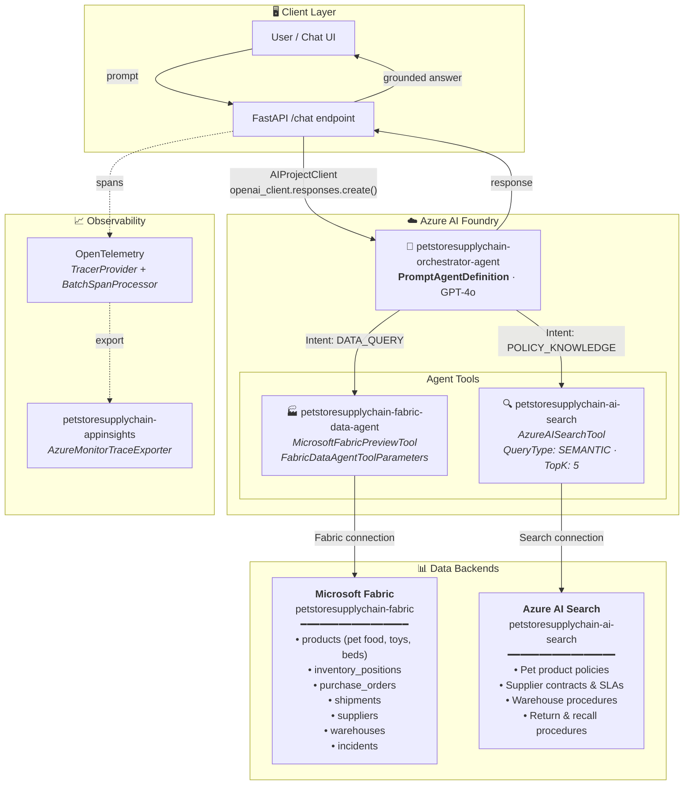
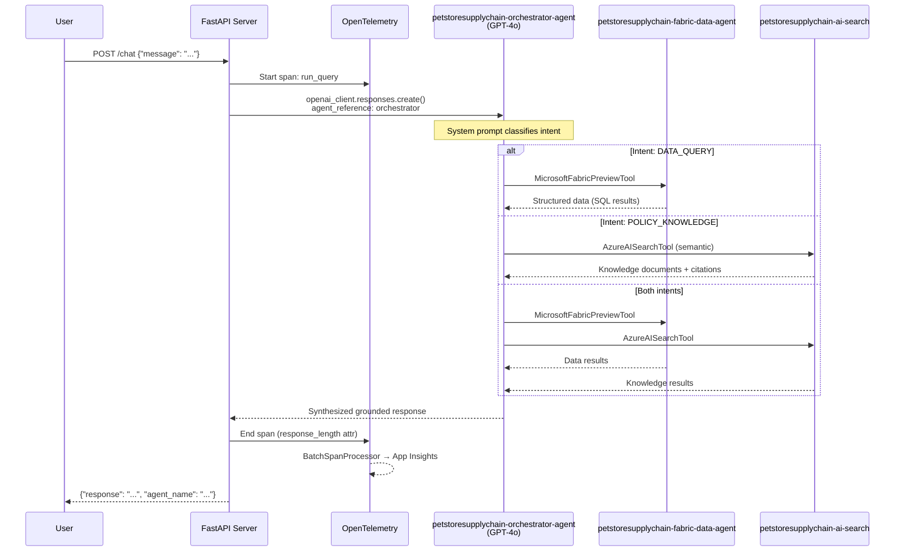
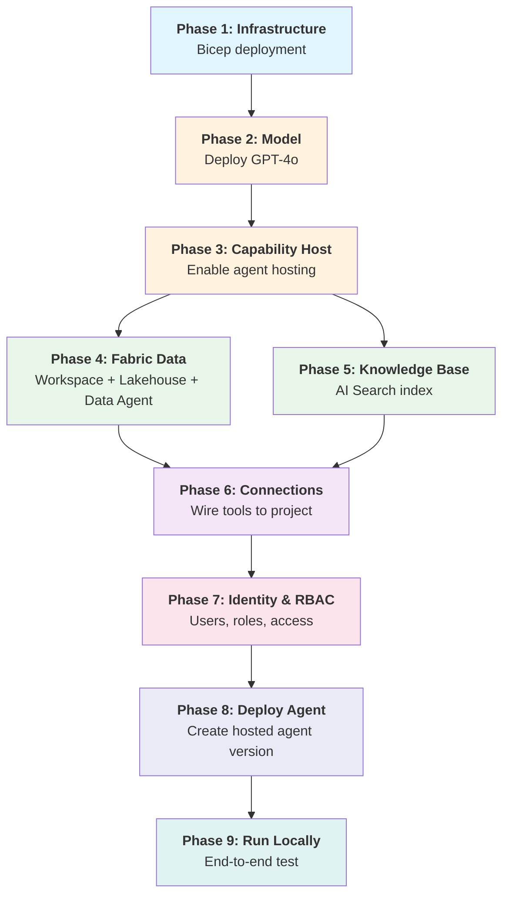
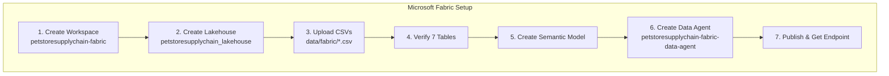
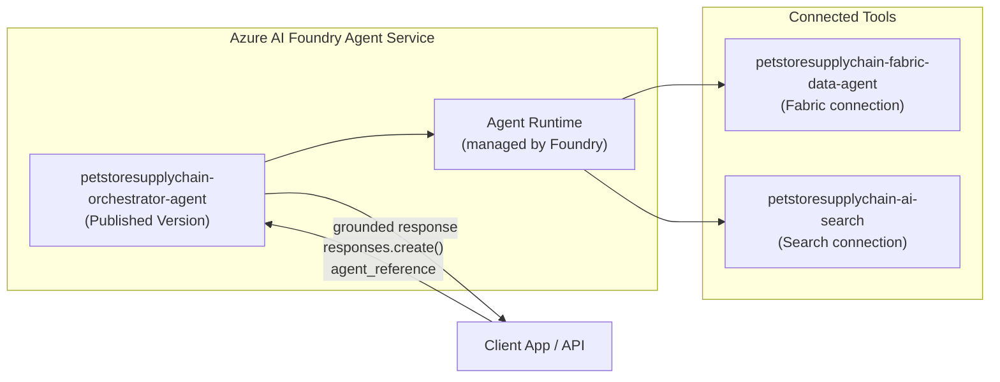
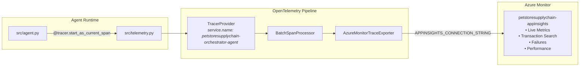

# 🐾 PetStore Supply Chain Orchestrator Agent

An end-to-end **agentic petstore retail supply chain orchestrator** built on **Azure AI Foundry**, combining intent-based routing, governed structured data via **Microsoft Fabric**, and grounded knowledge retrieval via **Azure AI Search**.

This solution demonstrates how a pet retail company manages its supply chain using AI agents to answer questions about product inventory, supplier performance, order tracking, and retail policies.

---

## 🏗️ Architecture



---

## 🔄 Request Flow



---

## 📦 Azure Resource Naming

All resources use the `petstoresupplychain` prefix:

| Resource | Name | Purpose |
|----------|------|---------|
| Resource Group | `petstoresupplychain` | Contains all Azure resources |
| AI Foundry Account | `petstoresupplychain-foundry` | Parent account for AI projects |
| AI Foundry Project | `petstoresupplychain-foundryproject` | Hosts agents, connections, models |
| Azure AI Search | `petstoresupplychain-search-*` | Knowledge index backend |
| Application Insights | `petstoresupplychain-appinsights` | Telemetry & traces |
| Log Analytics | `petstoresupplychain-logs` | Centralized logging |
| Container Registry | `petstoresupplychainacr*` | Docker images |
| Fabric Workspace | `petstoresupplychain-fabric` | Lakehouse + Data Agent |
| Orchestrator Agent | `petstoresupplychain-orchestrator-agent` | Main AI agent |
| Fabric Data Agent Tool | `petstoresupplychain-fabric-data-agent` | Structured data queries |
| AI Search Index | `petstoresupplychain-ai-search` | Knowledge retrieval |

---

## 📂 Project Structure

```
petstoresupplychain/
├── .env                        # Environment config (secrets, endpoints)
├── .gitignore
├── Dockerfile                  # Container image (Python 3.13 + FastAPI + Uvicorn)
├── requirements.txt            # Pinned Python dependencies
├── run.py                      # CLI entrypoint: python run.py
├── deploy.sh                   # One-command deploy to Foundry hosted agent
├── deploy_foundry_agent.py     # Programmatic agent version deployment
├── delete_agents.py            # Utility: list/delete agents and sessions
│
├── src/
│   ├── __init__.py
│   ├── config.py               # Settings dataclass loaded from .env
│   ├── telemetry.py            # OpenTelemetry → App Insights setup
│   ├── agent.py                # Core: creates agent, runs queries
│   ├── main.py                 # Interactive CLI loop
│   └── server.py               # FastAPI HTTP server (/chat, /health)
│
├── infra/
│   ├── main.bicep              # Orchestrates all Bicep modules
│   ├── main.parameters.json    # Default parameter values
│   ├── modules/                # Individual Bicep modules
│   └── scripts/                # Deployment & configuration scripts
│
├── data/
│   ├── fabric/                 # Pet product data → Fabric Lakehouse
│   │   ├── suppliers.csv       # Pet product suppliers
│   │   ├── products.csv        # Pet product catalog
│   │   ├── purchase_orders.csv # Orders to suppliers
│   │   ├── shipments.csv       # Shipment tracking
│   │   ├── inventory_positions.csv  # Stock levels by warehouse
│   │   ├── warehouses.csv      # Pet distribution centers
│   │   └── incidents.csv       # Supply disruption events
│   └── knowledge/              # Retail policies → AI Search
│       ├── policies/           # Shipping, escalation, supplier policies
│       ├── procedures/         # SOPs and playbooks
│       └── contracts/          # Supplier agreements and SLAs
│
└── tests/
    └── __init__.py
```

---

## 🚀 Full Deployment Guide (End-to-End)

### Prerequisites

| Tool | Version | Install |
|------|---------|---------|
| Python | 3.11+ | `brew install python@3.11` or [python.org](https://python.org) |
| Azure CLI | 2.60+ | `brew install azure-cli` |
| Git | 2.x | `brew install git` |

**Azure requirements:**
- Azure subscription with **Contributor** + **User Access Administrator** roles
- Microsoft Entra ID tenant
- Microsoft Fabric capacity (**P2** recommended — see Phase 4 for provisioning)

---

### Deployment Sequence



---

### Phase 1: Provision Azure Infrastructure (Bicep)

The `infra/` folder contains Bicep templates that deploy all Azure resources with a single command.

#### Step 1: Configure Environment Variables

```bash
cd petstore/petstoresupplychain

# Create your .env file with required values
cat > .env << 'EOF'
AZURE_SUBSCRIPTION_ID=<your-subscription-id>
AZURE_TENANT_ID=<your-tenant-id>
AZURE_LOCATION=swedencentral
RESOURCE_GROUP_NAME=petstoresupplychain
EOF
```

#### Step 2: Deploy All Infrastructure

```bash
# This single script: logs in, creates RG, deploys all Bicep resources
bash infra/scripts/bootstrap-env.sh
```

#### Step 3: Export Outputs to Environment

```bash
# Extracts all resource endpoints/keys into .env.generated
bash infra/scripts/export-deployment-outputs.sh
```

**What gets created:**

| Resource | Name | Bicep Module |
|----------|------|--------------|
| AI Foundry Account | `petstoresupplychain-foundry` | `foundry-account.bicep` |
| AI Foundry Project | `petstoresupplychain-foundryproject` | `foundry-project.bicep` |
| Azure AI Search | `petstoresupplychain-search-*` | `search.bicep` |
| Container Registry | `petstoresupplychainacr*` | `acr.bicep` |
| Application Insights | `petstoresupplychain-appinsights` | `app-insights.bicep` |
| Log Analytics | `petstoresupplychain-logs` | `log-analytics.bicep` |

---

### Phase 2: Deploy GPT-4o Model

**Option A: Azure Portal (recommended)**
1. Go to [Azure AI Foundry](https://ai.azure.com) → project `petstoresupplychain-foundryproject`
2. **Deployments** → **+ Create deployment**
3. Select **gpt-4o** → Standard deployment
4. Set TPM rate limit to **10K+**
5. Name: `gpt-4o`

**Option B: Azure CLI**
```bash
source .env.generated

az cognitiveservices account deployment create \
  --name "$FOUNDRY_ACCOUNT_NAME" \
  --resource-group petstoresupplychain \
  --deployment-name "gpt-4o" \
  --model-name "gpt-4o" \
  --model-version "2024-08-06" \
  --model-format OpenAI \
  --sku-capacity 10 \
  --sku-name Standard
```

Add to `.env`:
```bash
MODEL_DEPLOYMENT_NAME=gpt-4o
```

#### Fix: "You don't have permission to use the chat preview"

After deploying the model, you may see this error in the Foundry playground:

> *"You don't have permission to use the chat preview. Contact your admin to enable key authentication or Microsoft Entra ID authentication for your account."*

**To resolve**, assign yourself the required roles on the Foundry account:

```bash
source .env
source .env.generated

# Get your user Object ID
USER_OBJECT_ID=$(az ad signed-in-user show --query id -o tsv)

# Grant Cognitive Services OpenAI User (required to use the playground & call models)
az role assignment create \
  --assignee "$USER_OBJECT_ID" \
  --role "Cognitive Services OpenAI User" \
  --scope "/subscriptions/$AZURE_SUBSCRIPTION_ID/resourceGroups/petstoresupplychain/providers/Microsoft.CognitiveServices/accounts/$FOUNDRY_ACCOUNT_NAME"

# Grant Azure AI Developer (required to manage agents)
az role assignment create \
  --assignee "$USER_OBJECT_ID" \
  --role "Azure AI Developer" \
  --scope "/subscriptions/$AZURE_SUBSCRIPTION_ID/resourceGroups/petstoresupplychain/providers/Microsoft.CognitiveServices/accounts/$FOUNDRY_ACCOUNT_NAME"

# Grant Azure AI Administrator (required to build agents in the project)
az role assignment create \
  --assignee "$USER_OBJECT_ID" \
  --role "Azure AI Administrator" \
  --scope "/subscriptions/$AZURE_SUBSCRIPTION_ID/resourceGroups/petstoresupplychain/providers/Microsoft.CognitiveServices/accounts/$FOUNDRY_ACCOUNT_NAME"
```

> 💡 Role assignments can take **1–5 minutes** to propagate. Refresh the Foundry playground after waiting.

---

### Phase 3: Enable Capability Host

Required before any hosted agent can be deployed **and before the Foundry playground will work**. Without this, you'll see: *"You don't have permission to use the chat preview. Contact your admin to enable key authentication or Microsoft Entra ID authentication."*

```bash
bash infra/scripts/postprovision-capability-host.sh
```

This creates the Agents capability host on your Foundry account. Wait **2–3 minutes** for provisioning to complete before using the playground.

If the script fails, follow the portal fallback:
1. Azure Portal → AI Foundry account `petstoresupplychain-foundry` → **Settings** → **Capability Host**
2. Enable **Agents** capability with public hosting
3. Save and wait for provisioning

---

### Phase 4: Microsoft Fabric – Capacity, Workspace, Lakehouse & Data Agent

> ⚠️ **Manual Steps** — Fabric setup requires portal interaction.

#### 4.0 Provision Fabric Capacity (P2)

Before creating a Fabric workspace, you need a Fabric capacity provisioned in your Azure subscription. A **P2** SKU provides sufficient compute for the Lakehouse, Data Agent, and semantic model.

**Option A: Azure Portal**
1. Go to [Azure Portal](https://portal.azure.com) → search for **Microsoft Fabric**
2. Click **+ Create** → **Fabric capacity**
3. Configure:
   - **Subscription:** your Azure subscription
   - **Resource group:** `petstoresupplychain` (same as other resources)
   - **Capacity name:** `petstoresupplychain-fabric`
   - **Region:** same region as your other resources (e.g., `swedencentral`)
   - **Size:** **P2** (16 Capacity Units — sufficient for Lakehouse + Data Agent)
4. Click **Review + Create** → **Create**
5. Wait for provisioning to complete (typically 2–5 minutes)

**Option B: Azure CLI**
```bash
az fabric capacity create \
  --resource-group petstoresupplychain \
  --capacity-name petstoresupplychain-fabric \
  --location swedencentral \
  --sku-name P2 \
  --sku-tier Fabric \
  --administration-members "[\"yourname@yourdomain.com\"]"
```

> 💡 **Cost note:** P2 capacity incurs hourly charges (~$3/hr). You can **pause** it when not in use:
> ```bash
> # Pause (stop billing)
> az fabric capacity suspend \
>   --resource-group petstoresupplychain \
>   --capacity-name petstoresupplychain-fabric
>
> # Resume when needed
> az fabric capacity resume \
>   --resource-group petstoresupplychain \
>   --capacity-name petstoresupplychain-fabric
> ```

#### 4.1 Create Workspace & Load Data



#### Step-by-step:

1. **Create Workspace** — Go to [fabric.microsoft.com](https://app.fabric.microsoft.com)
   - Click **+ New workspace**
   - Name: `petstoresupplychain-fabric`
   - Under **License mode**, select **Fabric capacity**
   - Select your provisioned capacity: `petstoresupplychain-fabric (P2)`

2. **Create Lakehouse** — In the workspace:
   - **+ New** → **Lakehouse**
   - Name: `petstoresupplychain_lakehouse`

3. **Upload CSVs** — Upload all 7 files from `data/fabric/`:

   | File | Records | Description |
   |------|---------|-------------|
   | `suppliers.csv` | 10 | Pet product suppliers (food, toys, health, etc.) |
   | `products.csv` | 12 | Pet product catalog (dog food, cat toys, beds, etc.) |
   | `purchase_orders.csv` | 15 | Open/closed purchase orders |
   | `shipments.csv` | 11 | In-transit and delivered shipments |
   | `inventory_positions.csv` | 12 | Stock by warehouse/SKU |
   | `warehouses.csv` | 4 | Pet distribution center locations |
   | `incidents.csv` | 7 | Supply disruption events |

   To upload: Click **Get Data** → **Upload files** → select all CSVs → **Load to Tables**

4. **Verify Tables** — In the Lakehouse Explorer (left sidebar):
   - Expand **Tables** — you should see all 7 tables listed:
     `incidents`, `inventory_positions`, `products`, `purchase_orders`, `shipments`, `suppliers`, `warehouses`
   - Click on each table name to preview its data (top 100 rows)
   - Verify row counts match the expected values above
   - If a table is missing, re-upload the CSV: right-click **Tables** → **Load data** → **Upload file**

5. **Create Semantic Model (Ontology)** — This is what the Data Agent uses as its data source:
   - In the Lakehouse, click **New semantic model**
   - Name: `petstoresupplychain_ontology`
   - Select **all 7 tables** to include in the model
   - Define relationships between tables:
     ```
     suppliers.supplier_id       ──→  purchase_orders.supplier_id
     products.product_id         ──→  purchase_orders.product_id
     purchase_orders.po_id       ──→  shipments.po_id
     products.product_id         ──→  inventory_positions.product_id
     warehouses.warehouse_id     ──→  inventory_positions.warehouse_id
     suppliers.supplier_id       ──→  incidents.supplier_id
     ```
   - Save the semantic model

6. **Create Data Agent (from Ontology)** — In workspace:
   - **+ New** → **Data Agent** (preview)
   - Name: `petstoresupplychain-fabric-data-agent`
   - **Data source: select the semantic model** `petstoresupplychain_ontology` (not the raw Lakehouse)
   - The ontology gives the agent relationship awareness so it can join across tables correctly
   - Enable natural language queries
   - **Test**: *"Which pet food products are below reorder point?"*
   - **Publish** the agent

7. **Copy endpoint URL** → set `FABRIC_DATA_AGENT_ENDPOINT` in `.env`

---

### Phase 5: Knowledge Base – Azure AI Search

#### Step 1: Index Knowledge Documents

Upload the petstore retail policy documents from `data/knowledge/` to Azure AI Search:

```bash
# Ensure your .env and .env.generated are loaded
python scripts/upload_search_documents.py
```

This indexes 8 markdown files:
- **Policies**: Alternate supplier approval, expedited shipping, supplier escalation runbook
- **Procedures**: Shortage response playbook, warehouse receiving SOP
- **Contracts**: FurEver Toys master agreement, BarkWood Crafts terms, TailWag Logistics SLA

#### Step 2: Create Foundry Knowledge Base (Portal)

1. Go to [ai.azure.com](https://ai.azure.com) → project `petstoresupplychain-foundryproject` → **Knowledge Bases** → **+ New**
2. Name: `petstoresupplychain-ai-search`
3. Connect to your Azure AI Search service
4. Select index: `petstoresupplychain-ai-search`
5. Map fields: content → `content`, title → `title`, category → `category`
6. Save and test: *"What is the penalty for late pet product deliveries?"*

#### Step 3: Copy the MCP endpoint URL → set `FOUNDRY_IQ_MCP_URL` in `.env`

---

### Phase 6: Create Foundry Project Connections

Wire the Fabric data agent and Search service as connections:

```bash
python infra/scripts/create-foundry-connections.py
```

This creates:

| Connection Name | Type | Target |
|-----------------|------|--------|
| `petstoresupplychain-fabric-data-agent` | RemoteTool | Fabric data agent endpoint |
| `foundry-iq-mcp` | RemoteTool | Foundry IQ MCP endpoint |
| `acr-connection` | ContainerRegistry | ACR login server |
| `appinsights-connection` | ApplicationInsights | App Insights connection string |

If SDK creation fails, the script prints portal instructions:
> Azure AI Foundry → Project → **Settings** → **Connections** → **+ New Connection**

---

### Phase 7: Identity Management & RBAC

#### 7.1 Grant Foundry Managed Identity Access to AI Search

The Foundry project's managed identity needs access to query the search index:

```bash
source .env
source .env.generated

# Get the Foundry project managed identity principal ID
PROJECT_PRINCIPAL_ID=$(az deployment group show \
  --resource-group petstoresupplychain --name main \
  --query "properties.outputs.projectPrincipalId.value" -o tsv)

# Allow the managed identity to call GPT-4o
az role assignment create \
  --assignee "$PROJECT_PRINCIPAL_ID" \
  --role "Cognitive Services OpenAI User" \
  --scope "/subscriptions/$AZURE_SUBSCRIPTION_ID/resourceGroups/petstoresupplychain/providers/Microsoft.CognitiveServices/accounts/$FOUNDRY_ACCOUNT_NAME"

# Allow the managed identity to query AI Search
SEARCH_SERVICE_NAME=$(az search service list --resource-group petstoresupplychain --query "[0].name" -o tsv)

az role assignment create \
  --assignee "$PROJECT_PRINCIPAL_ID" \
  --role "Search Index Data Contributor" \
  --scope "/subscriptions/$AZURE_SUBSCRIPTION_ID/resourceGroups/petstoresupplychain/providers/Microsoft.Search/searchServices/$SEARCH_SERVICE_NAME"
```

#### 7.2 Grant Foundry Managed Identity Access to Fabric

In the Fabric portal, the Foundry project managed identity needs access to the data agent:

1. Open the Fabric workspace `petstoresupplychain-fabric` → **Manage access**
2. Click **+ Add people or groups**
3. Search for the Foundry project managed identity (find it under Enterprise Applications in Entra ID with the principal ID from above)
4. Assign **Contributor** role
5. Additionally, share the data agent explicitly:
   - Open the data agent `petstoresupplychain-fabric-data-agent`
   - Click **Share** → add the managed identity

#### 7.3 Grant Developer Access (for local testing)

```bash
# Add yourself to the Foundry project
az role assignment create \
  --assignee "yourname@yourdomain.com" \
  --role "Azure AI Developer" \
  --scope "/subscriptions/$AZURE_SUBSCRIPTION_ID/resourceGroups/petstoresupplychain/providers/Microsoft.CognitiveServices/accounts/$FOUNDRY_ACCOUNT_NAME"

# Allow yourself to use GPT-4o models
az role assignment create \
  --assignee "yourname@yourdomain.com" \
  --role "Cognitive Services OpenAI User" \
  --scope "/subscriptions/$AZURE_SUBSCRIPTION_ID/resourceGroups/petstoresupplychain/providers/Microsoft.CognitiveServices/accounts/$FOUNDRY_ACCOUNT_NAME"
```

#### 7.4 Summary of All Required Roles

| Principal | Role | Scope | Purpose |
|-----------|------|-------|---------|
| Foundry Project MI | AcrPull | Container Registry | Pull images |
| Foundry Project MI | Log Analytics Reader | Log Analytics | Read telemetry |
| Foundry Project MI | Cognitive Services OpenAI User | Foundry Account | Call GPT-4o |
| Foundry Project MI | Search Index Data Contributor | AI Search | Query knowledge index |
| Foundry Project MI | Contributor | Fabric Workspace | Access data agent |
| Developer User | Azure AI Developer | Foundry Account | Test agents |
| Developer User | Cognitive Services OpenAI User | Foundry Account | Use models |

---

### Phase 8: Configure & Deploy the Agent in Azure AI Foundry

#### 8.1 Deploy via CLI (Programmatic)

```bash
cd petstore/petstoresupplychain

# Deploy hosted agent version to Foundry
./deploy.sh

# Or with options
python deploy_foundry_agent.py \
  --agent-name petstoresupplychain-orchestrator-agent \
  --prune-old-versions --keep 3
```

#### 8.2 Configure via Azure AI Foundry Portal

If you prefer portal-based setup or need to verify the agent configuration:

1. **Navigate to your project:**
   - Go to [ai.azure.com](https://ai.azure.com)
   - Select project: **petstoresupplychain-foundryproject**

2. **Create the Agent:**
   - Go to **Agents** → **+ New Agent**
   - Name: `petstoresupplychain-orchestrator-agent`
   - Model: `gpt-4o` (select your deployed model)
   - Paste the system instructions from `src/agent.py` → `SYSTEM_INSTRUCTIONS`

3. **Add the Fabric Data Agent Tool:**
   - In the agent configuration, click **+ Add Tool**
   - Select **Microsoft Fabric (Preview)**
   - Connection: `petstoresupplychain-fabric-data-agent`
   - This routes data queries (inventory, orders, shipments) to your Fabric Lakehouse

4. **Add the Azure AI Search Tool:**
   - Click **+ Add Tool** again
   - Select **Azure AI Search**
   - Connection: select your AI Search connection
   - Index name: `petstoresupplychain-ai-search`
   - Query type: **Semantic**
   - Top K: `5`
   - This routes policy/knowledge queries to your indexed documents

5. **Test in Playground:**
   - Use the built-in chat playground to verify the agent works
   - Try: *"What pet products are below reorder point?"* → should invoke Fabric
   - Try: *"What is our expedited shipping policy?"* → should invoke AI Search
   - Try: *"Which suppliers are under review and what's the escalation process?"* → should invoke both tools

6. **Publish the Agent Version:**
   - Once satisfied, click **Publish** to create a versioned deployment
   - Note the agent version ID for production use

#### 8.3 Running in Azure AI Foundry Agent Service (Cloud-Hosted)

The agent runs as a **hosted agent** in the Foundry Agent Service — no container or VM required:



**How it works:**
- The agent is deployed as a **PromptAgentDefinition** with model, instructions, and tools
- Foundry Agent Service hosts and manages the agent runtime (no infrastructure to maintain)
- Clients call it via the OpenAI-compatible `responses.create()` API with an `agent_reference`
- The agent automatically routes to Fabric or AI Search based on intent classification

**Calling the hosted agent from any client:**

```python
from azure.identity import DefaultAzureCredential
from azure.ai.projects import AIProjectClient

credential = DefaultAzureCredential()
project_client = AIProjectClient(
    endpoint="<your-project-endpoint>",  # AZURE_AI_PROJECT_ENDPOINT
    credential=credential,
)

openai_client = project_client.get_openai_client()

# Create a conversation
conversation = openai_client.conversations.create()

# Send a message to the hosted agent
response = openai_client.responses.create(
    input="What pet food products are running low on stock?",
    conversation=conversation.id,
    extra_body={
        "agent_reference": {
            "name": "petstoresupplychain-orchestrator-agent",
            "type": "agent_reference"
        }
    },
)

print(response.output_text)
```

**Monitoring in Foundry Portal:**
- Go to **Agents** → select `petstoresupplychain-orchestrator-agent`
- **Traces** tab: see all conversations, tool calls, and latency
- **Sessions** tab: view active and historical sessions
- **Metrics**: token usage, success rate, average latency

---

### Phase 9: Run Locally & Validate

#### Setup Local Environment

```bash
# 1. Create virtual environment
python3.11 -m venv .venv && source .venv/bin/activate

# 2. Install dependencies
pip install -r requirements.txt

# 3. Ensure .env has all required values
cat .env
# Should contain:
#   AZURE_SUBSCRIPTION_ID=...
#   AZURE_AI_PROJECT_ENDPOINT=...  (from .env.generated)
#   MODEL_DEPLOYMENT_NAME=gpt-4o
#   APPINSIGHTS_CONNECTION_STRING=... (from .env.generated)
#   AGENT_NAME=petstoresupplychain-orchestrator-agent

# 4. Authenticate to Azure
az login && az account set --subscription $AZURE_SUBSCRIPTION_ID

# 5. Run interactive CLI
python run.py
```

> **Note:** Running locally still uses the **cloud-hosted agent** in Foundry. The local code creates a new agent version, opens a conversation, and sends messages to the Foundry Agent Service. It does NOT run the LLM locally.

#### Run as HTTP Server

```bash
pip install fastapi "uvicorn[standard]" pydantic
uvicorn src.server:app --host 0.0.0.0 --port 8080 --reload
```

Test the API:
```bash
curl http://localhost:8080/health

curl -X POST http://localhost:8080/chat \
  -H "Content-Type: application/json" \
  -d '{"message": "What pet food products are running low on stock?"}'
```

#### Test Queries

| Query | Expected Tool | Expected Source |
|-------|--------------|----------------|
| *"What pet products are below reorder point in the Northeast warehouse?"* | Fabric | `inventory_positions` table |
| *"What is our expedited shipping policy for pet food?"* | AI Search | `expedited_shipping_policy.md` |
| *"Which suppliers are flagged for escalation and what's the procedure?"* | Both | `suppliers` + `supplier_escalation_runbook.md` |
| *"How many dog toy orders are currently in transit?"* | Fabric | `purchase_orders` + `shipments` tables |
| *"What are the penalty terms in the FurEver Toys contract?"* | AI Search | `apex_supplier_master_agreement.md` |

---

## 📊 Observability



---

## 🔑 Environment Variables

| Variable | Description | Source |
|----------|-------------|--------|
| `AZURE_SUBSCRIPTION_ID` | Azure subscription | Azure Portal |
| `AZURE_TENANT_ID` | Entra ID tenant | Azure Portal |
| `AZURE_LOCATION` | Region (e.g. `swedencentral`) | — |
| `RESOURCE_GROUP_NAME` | Resource group (`petstoresupplychain`) | Phase 1 |
| `FOUNDRY_ACCOUNT_NAME` | AI Foundry account name | Phase 1 output |
| `AZURE_AI_PROJECT_ENDPOINT` | Foundry project endpoint | Phase 1 output |
| `MODEL_DEPLOYMENT_NAME` | GPT-4o deployment | Phase 2 |
| `SEARCH_ENDPOINT` | AI Search URL | Phase 1 output |
| `FABRIC_DATA_AGENT_ENDPOINT` | Fabric data agent URL | Phase 4, step 7 |
| `FOUNDRY_IQ_MCP_URL` | Knowledge base MCP URL | Phase 5, step 3 |
| `APPINSIGHTS_CONNECTION_STRING` | Telemetry connection | Phase 1 output |
| `ACR_NAME` | Container Registry name | Phase 1 output |
| `AGENT_NAME` | `petstoresupplychain-orchestrator-agent` | Config |

---

## 🛠️ Utility Scripts

| Script | Purpose |
|--------|---------|
| `python run.py` | Interactive CLI agent |
| `uvicorn src.server:app` | HTTP API server |
| `python deploy_foundry_agent.py` | Deploy new hosted agent version |
| `./deploy.sh` | Shell wrapper for deploy |
| `python delete_agents.py` | List/delete agents and sessions |

---

## 📚 References

- [Azure AI Projects SDK (PyPI)](https://pypi.org/project/azure-ai-projects/)
- [Azure AI Agents SDK (PyPI)](https://pypi.org/project/azure-ai-agents/)
- [Foundry Agent Samples](https://github.com/Azure/azure-sdk-for-python/tree/main/sdk/ai/azure-ai-projects/samples)
- [Microsoft Fabric Data Agent](https://learn.microsoft.com/fabric/data-engineering/data-agent)
- [Azure AI Search](https://learn.microsoft.com/azure/search/)
- [Azure RBAC Built-in Roles](https://learn.microsoft.com/azure/role-based-access-control/built-in-roles)
- [OpenTelemetry Python](https://opentelemetry.io/docs/languages/python/)
