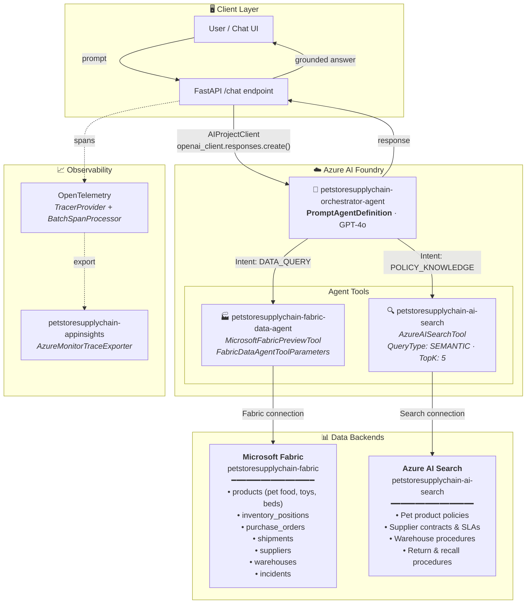
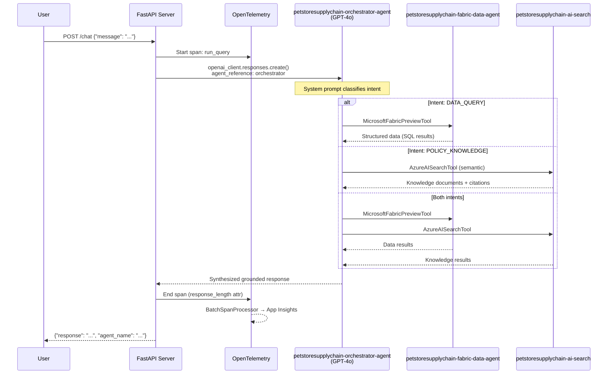
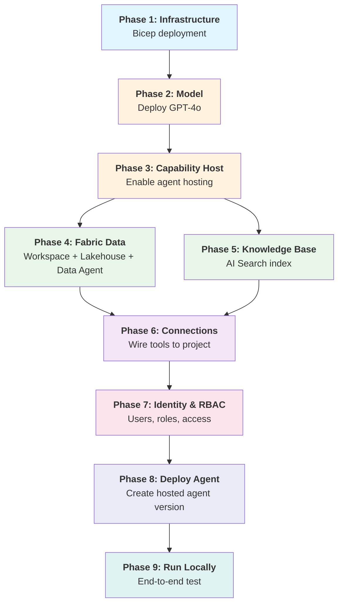
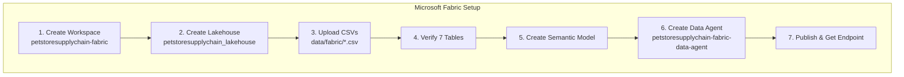
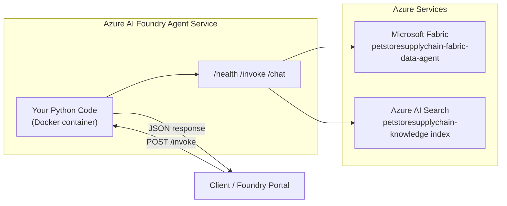
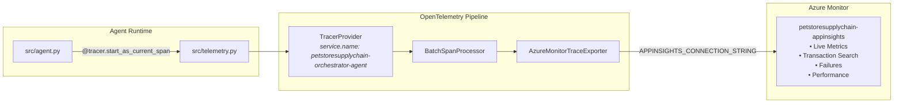

# 🐾 PetStore Supply Chain Orchestrator Agent

An end-to-end **agentic petstore retail supply chain orchestrator** built on **Azure AI Foundry**, combining intent-based routing, governed structured data via **Microsoft Fabric**, and grounded knowledge retrieval via **Azure AI Search**.

This solution demonstrates how a pet retail company manages its supply chain using AI agents to answer questions about product inventory, supplier performance, order tracking, and retail policies.

---

## 🏗️ Architecture



---

## 🔄 Request Flow



---

## 📦 Azure Resource Naming

All resources use the `petstoresupplychain` prefix:

| Resource | Name | Purpose |
|----------|------|---------|
| Resource Group | `petstoresupplychain` | Contains all Azure resources |
| AI Foundry Account | `petstoresupplychain-foundry` | Parent account for AI projects |
| AI Foundry Project | `petstoresupplychain-foundryproject` | Hosts agents, connections, models |
| Azure AI Search | `petstoresupplychain-search-*` | Knowledge index backend |
| Application Insights | `petstoresupplychain-appinsights` | Telemetry & traces |
| Log Analytics | `petstoresupplychain-logs` | Centralized logging |
| Container Registry | `petstoresupplychainacr*` | Docker images |
| Fabric Workspace | `petstoresupplychain-fabric` | Lakehouse + Data Agent |
| Orchestrator Agent | `petstoresupplychain-orchestrator-agent` | Main AI agent |
| Fabric Data Agent Tool | `petstoresupplychain-fabric-data-agent` | Structured data queries |
| AI Search Index | `petstoresupplychain-ai-search` | Knowledge retrieval |

---

## 📂 Project Structure

```
petstoresupplychain/
├── .env                        # Environment config (secrets, endpoints)
├── .gitignore
├── Dockerfile                  # Container image (Python 3.13 + FastAPI + Uvicorn)
├── requirements.txt            # Pinned Python dependencies
├── run.py                      # CLI entrypoint: python run.py
├── deploy.sh                   # One-command deploy to Foundry hosted agent
├── deploy_foundry_agent.py     # Programmatic agent version deployment
├── delete_agents.py            # Utility: list/delete agents and sessions
│
├── src/
│   ├── __init__.py
│   ├── config.py               # Settings dataclass loaded from .env
│   ├── telemetry.py            # OpenTelemetry → App Insights setup
│   ├── agent.py                # Core: creates agent, runs queries
│   ├── main.py                 # Interactive CLI loop
│   └── server.py               # FastAPI HTTP server (/chat, /health)
│
├── infra/
│   ├── main.bicep              # Orchestrates all Bicep modules
│   ├── main.parameters.json    # Default parameter values
│   ├── modules/                # Individual Bicep modules
│   └── scripts/                # Deployment & configuration scripts
│
├── data/
│   ├── fabric/                 # Pet product data → Fabric Lakehouse
│   │   ├── suppliers.csv       # Pet product suppliers
│   │   ├── products.csv        # Pet product catalog
│   │   ├── purchase_orders.csv # Orders to suppliers
│   │   ├── shipments.csv       # Shipment tracking
│   │   ├── inventory_positions.csv  # Stock levels by warehouse
│   │   ├── warehouses.csv      # Pet distribution centers
│   │   └── incidents.csv       # Supply disruption events
│   └── knowledge/              # Retail policies → AI Search
│       ├── policies/           # Shipping, escalation, supplier policies
│       ├── procedures/         # SOPs and playbooks
│       └── contracts/          # Supplier agreements and SLAs
│
└── tests/
    └── __init__.py
```

---

## 🚀 Full Deployment Guide (End-to-End)

### Prerequisites

| Tool | Version | Install |
|------|---------|---------|
| Python | 3.11+ | `brew install python@3.11` or [python.org](https://python.org) |
| Azure CLI | 2.60+ | `brew install azure-cli` |
| Git | 2.x | `brew install git` |

**Azure requirements:**
- Azure subscription with **Contributor** + **User Access Administrator** roles
- Microsoft Entra ID tenant
- Microsoft Fabric capacity (**P2** recommended — see Phase 4 for provisioning)

---

### Deployment Sequence



---

### Phase 1: Provision Azure Infrastructure (Bicep)

The `infra/` folder contains Bicep templates that deploy all Azure resources with a single command.

#### Step 1: Configure Environment Variables

```bash
cd petstore/petstoresupplychain

# Create your .env file with required values
cat > .env << 'EOF'
AZURE_SUBSCRIPTION_ID=<your-subscription-id>
AZURE_TENANT_ID=<your-tenant-id>
AZURE_LOCATION=swedencentral
RESOURCE_GROUP_NAME=petstoresupplychain
EOF
```

#### Step 2: Deploy All Infrastructure

```bash
# This single script: logs in, creates RG, deploys all Bicep resources
bash infra/scripts/bootstrap-env.sh
```

#### Step 3: Export Outputs to Environment

```bash
# Extracts all resource endpoints/keys into .env.generated
bash infra/scripts/export-deployment-outputs.sh
```

**What gets created:**

| Resource | Name | Bicep Module |
|----------|------|--------------|
| AI Foundry Account | `petstoresupplychain-foundry` | `foundry-account.bicep` |
| AI Foundry Project | `petstoresupplychain-foundryproject` | `foundry-project.bicep` |
| Azure AI Search | `petstoresupplychain-search-*` | `search.bicep` |
| Container Registry | `petstoresupplychainacr*` | `acr.bicep` |
| Application Insights | `petstoresupplychain-appinsights` | `app-insights.bicep` |
| Log Analytics | `petstoresupplychain-logs` | `log-analytics.bicep` |

---

### Phase 2: Deploy GPT-4o Model

**Option A: Azure Portal (recommended)**
1. Go to [Azure AI Foundry](https://ai.azure.com) → project `petstoresupplychain-foundryproject`
2. **Deployments** → **+ Create deployment**
3. Select **gpt-4o** → Standard deployment
4. Set TPM rate limit to **10K+**
5. Name: `gpt-4o`

**Option B: Azure CLI**
```bash
source .env.generated

az cognitiveservices account deployment create \
  --name "$FOUNDRY_ACCOUNT_NAME" \
  --resource-group petstoresupplychain \
  --deployment-name "gpt-4o" \
  --model-name "gpt-4o" \
  --model-version "2024-08-06" \
  --model-format OpenAI \
  --sku-capacity 10 \
  --sku-name Standard
```

Add to `.env`:
```bash
MODEL_DEPLOYMENT_NAME=gpt-4o
```

#### Fix: "You don't have permission to use the chat preview" / "You don't have permission to build agents"

After deploying the model, you may see these errors in the Foundry playground:

> *"You don't have permission to use the chat preview. Contact your admin to enable key authentication or Microsoft Entra ID authentication for your account."*
>
> *"You don't have permission to build agents in this project. To get access, please ask your administrator to assign you the Azure AI User role."*

**To resolve**, add your user as **AI Developer** directly on the Foundry project via the portal:

1. Go to [ai.azure.com](https://ai.azure.com) → select project **petstoresupplychain-foundryproject**
2. Click **Management center** (gear icon) → **Overview** or **Project settings**
3. Under **Members** / **Access control**, click **+ Add member**
4. Search for your account and assign the **AI Developer** role
5. Save — this resolves both the playground chat and agent builder permissions

**Alternatively via CLI** (may take longer to propagate):

```bash
source .env
source .env.generated

# Get your user Object ID
USER_OBJECT_ID=$(az ad signed-in-user show --query id -o tsv)

# The project is a sub-resource of the account
PROJECT_SCOPE="/subscriptions/$AZURE_SUBSCRIPTION_ID/resourceGroups/petstoresupplychain/providers/Microsoft.CognitiveServices/accounts/$FOUNDRY_ACCOUNT_NAME/projects/petstoresupplychain-foundryproject"

# Grant Azure AI Developer on the project (fixes both errors)
az role assignment create \
  --assignee "$USER_OBJECT_ID" \
  --role "Azure AI Developer" \
  --scope "$PROJECT_SCOPE"
```

> 💡 Role assignments can take **1–5 minutes** to propagate. Refresh the Foundry playground after waiting.

---

### Phase 3: Enable Capability Host

Required before any hosted agent can be deployed **and before the Foundry playground will work**. Without this, you'll see: *"You don't have permission to use the chat preview. Contact your admin to enable key authentication or Microsoft Entra ID authentication."*

```bash
bash infra/scripts/postprovision-capability-host.sh
```

This creates the Agents capability host on your Foundry account. Wait **2–3 minutes** for provisioning to complete before using the playground.

If the script fails, follow the portal fallback:
1. Azure Portal → AI Foundry account `petstoresupplychain-foundry` → **Settings** → **Capability Host**
2. Enable **Agents** capability with public hosting
3. Save and wait for provisioning

---

### Phase 4: Microsoft Fabric – Capacity, Workspace, Lakehouse & Data Agent

> ⚠️ **Manual Steps** — Fabric setup requires portal interaction.

#### 4.0 Provision Fabric Capacity (P2)

Before creating a Fabric workspace, you need a Fabric capacity provisioned in your Azure subscription. A **P2** SKU provides sufficient compute for the Lakehouse, Data Agent, and semantic model.

**Option A: Azure Portal**
1. Go to [Azure Portal](https://portal.azure.com) → search for **Microsoft Fabric**
2. Click **+ Create** → **Fabric capacity**
3. Configure:
   - **Subscription:** your Azure subscription
   - **Resource group:** `petstoresupplychain` (same as other resources)
   - **Capacity name:** `petstoresupplychain-fabric`
   - **Region:** same region as your other resources (e.g., `swedencentral`)
   - **Size:** **P2** (16 Capacity Units — sufficient for Lakehouse + Data Agent)
4. Click **Review + Create** → **Create**
5. Wait for provisioning to complete (typically 2–5 minutes)

**Option B: Azure CLI**
```bash
az fabric capacity create \
  --resource-group petstoresupplychain \
  --capacity-name petstoresupplychain-fabric \
  --location swedencentral \
  --sku-name P2 \
  --sku-tier Fabric \
  --administration-members "[\"yourname@yourdomain.com\"]"
```

> 💡 **Cost note:** P2 capacity incurs hourly charges (~$3/hr). You can **pause** it when not in use:
> ```bash
> # Pause (stop billing)
> az fabric capacity suspend \
>   --resource-group petstoresupplychain \
>   --capacity-name petstoresupplychain-fabric
>
> # Resume when needed
> az fabric capacity resume \
>   --resource-group petstoresupplychain \
>   --capacity-name petstoresupplychain-fabric
> ```

#### 4.1 Create Workspace & Load Data



#### Step-by-step:

1. **Create Workspace** — Go to [fabric.microsoft.com](https://app.fabric.microsoft.com)
   - Click **+ New workspace**
   - Name: `petstoresupplychain-fabric`
   - Under **License mode**, select **Fabric capacity**
   - Select your provisioned capacity: `petstoresupplychain-fabric (P2)`

2. **Create Lakehouse** — In the workspace:
   - **+ New** → **Lakehouse**
   - Name: `petstoresupplychain_lakehouse`

3. **Upload CSVs** — Upload all 7 files from `data/fabric/`:

   | File | Records | Description |
   |------|---------|-------------|
   | `suppliers.csv` | 10 | Pet product suppliers (food, toys, health, etc.) |
   | `products.csv` | 12 | Pet product catalog (dog food, cat toys, beds, etc.) |
   | `purchase_orders.csv` | 15 | Open/closed purchase orders |
   | `shipments.csv` | 11 | In-transit and delivered shipments |
   | `inventory_positions.csv` | 12 | Stock by warehouse/SKU |
   | `warehouses.csv` | 4 | Pet distribution center locations |
   | `incidents.csv` | 7 | Supply disruption events |

   To upload: Click **Get Data** → **Upload files** → select all CSVs → **Load to Tables**

4. **Verify Tables** — In the Lakehouse Explorer (left sidebar):
   - Expand **Tables** — you should see all 7 tables listed:
     `incidents`, `inventory_positions`, `products`, `purchase_orders`, `shipments`, `suppliers`, `warehouses`
   - Click on each table name to preview its data (top 100 rows)
   - Verify row counts match the expected values above
   - If a table is missing, re-upload the CSV: right-click **Tables** → **Load data** → **Upload file**

5. **Create Ontology (Preview)** — This is what the Data Agent uses as its data source:

   > **Prerequisite**: Your tenant admin must enable **Ontology item (preview)** in the Fabric Admin Portal → Tenant Settings.

   a. In your workspace, click **+ New** → **Ontology (Preview)**
   b. Name: `petstoresupplychain_ontology` → click **Create**
   c. **Add Entity Types** — For each of your 7 tables, add an entity type:
      - Click **+ Add entity type**
      - Name it to match the table (e.g., `suppliers`, `products`, `purchase_orders`, etc.)
      - Go to the **Bindings** tab → click **Add data to entity type**
      - Select your Lakehouse → select the matching table
      - Columns auto-populate as properties; verify types are correct
      - Set the **entity key** (primary key) for each entity type:
        | Entity Type          | Key                |
        |----------------------|--------------------|
        | suppliers            | supplier_id        |
        | products             | product_id         |
        | purchase_orders      | po_id              |
        | shipments            | shipment_id        |
        | inventory_positions  | product_id         |
        | warehouses           | warehouse_id       |
        | incidents            | incident_id        |
      - Repeat for all 7 tables
   d. **Add Relationships** — Click **+ Add relationship type** for each:
      | Relationship              | From Entity        | To Entity            | Key               |
      |---------------------------|--------------------|----------------------|-------------------|
      | supplier_places_orders    | suppliers          | purchase_orders      | supplier_id       |
      | product_in_orders         | products           | purchase_orders      | product_id        |
      | order_has_shipments       | purchase_orders    | shipments            | po_id             |
      | product_inventory         | products           | inventory_positions  | product_id        |
      | warehouse_inventory       | warehouses         | inventory_positions  | warehouse_id      |
      | supplier_incidents        | suppliers          | incidents            | supplier_id       |
      - For each relationship, bind the foreign key property from your data
   e. **Preview** — Click the graph view icon to visualize your ontology and confirm all entities and relationships appear
   f. **Save** the ontology

6. **Create Data Agent (from Ontology)** — In workspace:
   - **+ New** → **Data Agent** (preview)
   - Name: `petstoresupplychain-fabric-data-agent`
   - **Data source: select the ontology** `petstoresupplychain_ontology` (not the raw Lakehouse)
   - The ontology (preview) gives the agent relationship awareness so it can join across tables correctly
   - Enable natural language queries
   - **Test**: *"Which pet food products are below reorder point?"*
   - **Publish** the agent

7. **Copy endpoint URL** → set `FABRIC_DATA_AGENT_ENDPOINT` in `.env`

---

### Phase 5: Knowledge Base – Azure AI Search

#### Step 1: Enable Entra ID Auth & Grant Yourself Access to AI Search

The search service defaults to API-key-only auth. Enable Entra ID (RBAC) auth and assign yourself the required roles:

```bash
# Get your search service name
SEARCH_NAME=$(grep SEARCH_ENDPOINT .env.generated | sed 's|.*https://||;s|\.search.*||')

# Enable Entra ID + API key auth
az search service update --name "$SEARCH_NAME" --resource-group petstoresupplychain \
  --aad-auth-failure-mode http401WithBearerChallenge --auth-options aadOrApiKey

# Assign yourself contributor roles
USER_ID=$(az ad signed-in-user show --query id -o tsv)
SEARCH_ID=$(az resource list --resource-group petstoresupplychain \
  --resource-type "Microsoft.Search/searchServices" --query "[0].id" -o tsv)

az role assignment create --assignee "$USER_ID" --role "Search Service Contributor" --scope "$SEARCH_ID"
az role assignment create --assignee "$USER_ID" --role "Search Index Data Contributor" --scope "$SEARCH_ID"
```

> ⏳ Wait 1–2 minutes for RBAC propagation before proceeding.

#### Step 2: Index Knowledge Documents

Upload the petstore retail policy documents from `data/knowledge/` to Azure AI Search:

```bash
python3 infra/scripts/upload_search_documents.py
```

This indexes 8 markdown files:
- **Policies**: Alternate supplier approval, expedited shipping, supplier escalation runbook
- **Procedures**: Shortage response playbook, warehouse receiving SOP
- **Contracts**: FurEver Toys master agreement, BarkWood Crafts terms, TailWag Logistics SLA

#### Step 3: Create Foundry Knowledge Base (Portal)

1. Go to [ai.azure.com](https://ai.azure.com) → project `petstoresupplychain-foundryproject` → **Knowledge Bases** → **+ New**
2. Name: `petstoresupplychain-ai-search`
3. Select the `petstoresupplychain-search-*` resource (the AI Search service created by Bicep)
4. Select index: `petstoresupplychain-knowledge`
5. Save

---

### Phase 6: Create Foundry Project Connections

Wire the Fabric data agent and Search service as connections:

```bash
python infra/scripts/create-foundry-connections.py
```

This creates:

| Connection Name | Type | Target |
|-----------------|------|--------|
| `petstoresupplychain-fabric-data-agent` | RemoteTool | Fabric data agent endpoint |
| `appinsights-connection` | ApplicationInsights | App Insights connection string |

If SDK creation fails, the script prints portal instructions:
> Azure AI Foundry → Project → **Settings** → **Connections** → **+ New Connection**

---

### Phase 7: Identity Management & RBAC

#### 7.1 Grant Foundry Managed Identity Access to AI Search

The Foundry project's managed identity needs access to query the search index:

```bash
source .env
source .env.generated

# Get the Foundry project managed identity principal ID
PROJECT_PRINCIPAL_ID=$(az deployment group show \
  --resource-group petstoresupplychain --name main \
  --query "properties.outputs.projectPrincipalId.value" -o tsv)

# Allow the managed identity to call GPT-4o
az role assignment create \
  --assignee "$PROJECT_PRINCIPAL_ID" \
  --role "Cognitive Services OpenAI User" \
  --scope "/subscriptions/$AZURE_SUBSCRIPTION_ID/resourceGroups/petstoresupplychain/providers/Microsoft.CognitiveServices/accounts/$FOUNDRY_ACCOUNT_NAME"

# Allow the managed identity to query AI Search
SEARCH_SERVICE_NAME=$(az search service list --resource-group petstoresupplychain --query "[0].name" -o tsv)

az role assignment create \
  --assignee "$PROJECT_PRINCIPAL_ID" \
  --role "Search Index Data Contributor" \
  --scope "/subscriptions/$AZURE_SUBSCRIPTION_ID/resourceGroups/petstoresupplychain/providers/Microsoft.Search/searchServices/$SEARCH_SERVICE_NAME"
```

#### 7.2 Grant Foundry Managed Identity Access to Fabric

In the Fabric portal, the Foundry project managed identity needs access to the data agent:

1. Open the Fabric workspace `petstoresupplychain-fabric` → **Manage access**
2. Click **+ Add people or groups**
3. Search for the Foundry project managed identity (find it under Enterprise Applications in Entra ID with the principal ID from above)
4. Assign **Contributor** role
5. Additionally, share the data agent explicitly:
   - Open the data agent `petstoresupplychain-fabric-data-agent`
   - Click **Share** → add the managed identity

#### 7.3 Grant Developer Access (for local testing)

```bash
# Add yourself to the Foundry project
az role assignment create \
  --assignee "yourname@yourdomain.com" \
  --role "Azure AI Developer" \
  --scope "/subscriptions/$AZURE_SUBSCRIPTION_ID/resourceGroups/petstoresupplychain/providers/Microsoft.CognitiveServices/accounts/$FOUNDRY_ACCOUNT_NAME"

# Allow yourself to use GPT-4o models
az role assignment create \
  --assignee "yourname@yourdomain.com" \
  --role "Cognitive Services OpenAI User" \
  --scope "/subscriptions/$AZURE_SUBSCRIPTION_ID/resourceGroups/petstoresupplychain/providers/Microsoft.CognitiveServices/accounts/$FOUNDRY_ACCOUNT_NAME"
```

#### 7.4 Summary of All Required Roles

| Principal | Role | Scope | Purpose |
|-----------|------|-------|---------|
| Foundry Project MI | AcrPull | Container Registry | Pull images |
| Foundry Project MI | Log Analytics Reader | Log Analytics | Read telemetry |
| Foundry Project MI | Cognitive Services OpenAI User | Foundry Account | Call GPT-4o |
| Foundry Project MI | Search Index Data Contributor | AI Search | Query knowledge index |
| Foundry Project MI | Contributor | Fabric Workspace | Access data agent |
| Developer User | Azure AI Developer | Foundry Account | Test agents |
| Developer User | Cognitive Services OpenAI User | Foundry Account | Use models |

---

### Phase 8: Run & Test Locally

Run the same code locally that will be deployed to Foundry. Locally, the agent connects to Azure services (Foundry, AI Search, Fabric) via your `az login` credentials.

#### 8.1 Setup Local Environment

```bash
# 1. Create virtual environment
python3 -m venv .venv && source .venv/bin/activate

# 2. Install dependencies
pip install -r requirements.txt

# 3. Authenticate to Azure
az login && az account set --subscription $(grep AZURE_SUBSCRIPTION_ID .env | cut -d= -f2)
```

#### 8.2 Run as Interactive CLI

```bash
python3 run.py
```

This creates an agent version in Foundry and starts an interactive chat in your terminal.

#### 8.3 Run as HTTP Server (Same as Foundry Runtime)

This is exactly how the agent runs when deployed to Foundry:

```bash
uvicorn src.server:app --host 0.0.0.0 --port 8080 --reload
```

Test endpoints:
```bash
# Health check
curl http://localhost:8080/health

# Chat (simple)
curl -X POST http://localhost:8080/chat \
  -H "Content-Type: application/json" \
  -d '{"message": "What pet food products are running low on stock?"}'

# Invoke (Foundry protocol — same payload Foundry sends)
curl -X POST http://localhost:8080/invoke \
  -H "Content-Type: application/json" \
  -d '{"messages": [{"role": "user", "content": "What is our expedited shipping policy?"}]}'
```

#### 8.4 Test Queries

| Query | Expected Tool | Expected Source |
|-------|--------------|----------------|
| *"What pet products are below reorder point in the Northeast warehouse?"* | Fabric | `inventory_positions` table |
| *"What is our expedited shipping policy for pet food?"* | AI Search | `expedited_shipping_policy.md` |
| *"Which suppliers are flagged for escalation and what's the procedure?"* | Both | `suppliers` + `supplier_escalation_runbook.md` |
| *"How many dog toy orders are currently in transit?"* | Fabric | `purchase_orders` + `shipments` tables |
| *"What are the penalty terms in the FurEver Toys contract?"* | AI Search | `apex_supplier_master_agreement.md` |

---

### Phase 9: Build & Deploy to Azure AI Foundry (Hosted Code Agent)

Once validated locally, deploy to Foundry as a **Hosted (Code) agent**. This runs your Python code in Foundry's managed infrastructure and shows as **"Hosted"** type in the portal.

#### 9.1 Build & Push Container Image

```bash
# Source .env.generated for ACR_LOGIN_SERVER
source .env.generated

# Login to Azure Container Registry
az acr login --name $(echo $ACR_LOGIN_SERVER | cut -d. -f1)

# Build the Docker image
docker build -t $ACR_LOGIN_SERVER/petstoresupplychain-orchestrator:latest .

# Push to ACR
docker push $ACR_LOGIN_SERVER/petstoresupplychain-orchestrator:latest
```

> **No Docker?** Build remotely with ACR:
> ```bash
> az acr build --registry $(echo $ACR_LOGIN_SERVER | cut -d. -f1) \
>   --image petstoresupplychain-orchestrator:latest .
> ```

#### 9.2 Deploy to Foundry

```bash
# Deploy container to Foundry as hosted agent
./deploy.sh --method container

# Or deploy source code directly (no Docker needed)
./deploy.sh --method source
```

After deployment, verify in the portal:
- Go to [ai.azure.com](https://ai.azure.com) → project → **Agents**
- You should see `petstoresupplychain-orchestrator-agent` with type **Hosted**

#### 9.3 Project Structure — What Runs in Foundry

| File | Purpose |
|------|---------|
| `Dockerfile` | Container definition (Python 3.13 + FastAPI + uvicorn) |
| `agent.yaml` | Manifest — tells Foundry runtime, entrypoint, health check |
| `src/server.py` | FastAPI app with `/health`, `/chat`, and `/invoke` endpoints |
| `src/agent.py` | Your custom agent logic — tool wiring, system prompt, query execution |
| `src/config.py` | Environment-based configuration |
| `requirements.txt` | Python dependencies |

#### 9.4 Architecture



**Key points:**
- **Local** = `uvicorn src.server:app` on your laptop (same code, same endpoints)
- **Foundry** = same container running in Foundry's managed infrastructure
- Shows as **"Hosted"** in the portal (vs "Prompt" which is just a config declaration)
- You have full control over the Python runtime — add custom logic, middleware, logging
- Foundry injects `AZURE_AI_PROJECT_ENDPOINT` and managed identity automatically

#### 9.5 Configure Managed Identity (Required)

The hosted agent runs with a **system-assigned managed identity**. This identity must have RBAC permissions to access the AI Project, connections (Fabric, AI Search), and model deployments. Without these roles, the agent will fail to start with authentication errors and the `/readiness` endpoint will never return HTTP 200.

**Assign required roles:**

```bash
# Get the managed identity principal ID for your Foundry account
PRINCIPAL_ID=$(az cognitiveservices account identity show \
  --name <your-foundry-account-name> \
  --resource-group <your-resource-group> \
  --query principalId -o tsv)

# Assign Cognitive Services OpenAI User (for model calls)
az role assignment create \
  --assignee $PRINCIPAL_ID \
  --role "Cognitive Services OpenAI User" \
  --scope "/subscriptions/<subscription-id>/resourceGroups/<resource-group>"

# Assign Azure AI Developer (for project/connections APIs)
az role assignment create \
  --assignee $PRINCIPAL_ID \
  --role "Azure AI Developer" \
  --scope "/subscriptions/<subscription-id>/resourceGroups/<resource-group>"
```

> **⏱️ Note:** Role assignments can take **1–5 minutes** to propagate. Wait before deploying or invoking the agent.

**Verify roles are assigned:**

```bash
az role assignment list --assignee $PRINCIPAL_ID --all -o table
```

You should see both `Cognitive Services OpenAI User` and `Azure AI Developer`.

#### 9.6 Calling the Deployed Agent

```python
from azure.identity import DefaultAzureCredential
from azure.ai.projects import AIProjectClient

credential = DefaultAzureCredential()
project_client = AIProjectClient(
    endpoint="<your-project-endpoint>",  # AZURE_AI_PROJECT_ENDPOINT
    credential=credential,
)

openai_client = project_client.get_openai_client()
conversation = openai_client.conversations.create()

response = openai_client.responses.create(
    input="What pet food products are running low on stock?",
    conversation=conversation.id,
    extra_body={
        "agent_reference": {
            "name": "petstoresupplychain-orchestrator-agent",
            "type": "agent_reference"
        }
    },
)

print(response.output_text)
```

#### 9.7 Monitoring & Troubleshooting

- **Foundry Portal** → Agents → select agent → **Traces** / **Sessions** / **Metrics**
- **App Insights** → traces from `src/telemetry.py` (OpenTelemetry)
- **Log Stream** → available in Foundry portal under agent → Logs

**Troubleshooting readiness timeout:**

If you see `Session did not become ready within the expected timeout`:

1. **Check managed identity roles** (see step 9.5) — most common cause
2. **Check log stream** — if empty, the app may be crashing before Python starts (bad `entry_point` or missing dependency)
3. **Test locally first:**
   ```bash
   source .venv/bin/activate
   python run_server.py
   # In another terminal:
   curl http://localhost:8080/readiness
   ```
4. **Verify `PYTHONUNBUFFERED=1`** is set in environment variables (ensures logs flush to log stream immediately)
5. **Check `APPINSIGHTS_CONNECTION_STRING`** is passed as an environment variable in the deploy

---

## 📊 Observability



---

## 🔑 Environment Variables

| Variable | Description | Source |
|----------|-------------|--------|
| `AZURE_SUBSCRIPTION_ID` | Azure subscription | Azure Portal |
| `AZURE_TENANT_ID` | Entra ID tenant | Azure Portal |
| `AZURE_LOCATION` | Region (e.g. `swedencentral`) | — |
| `RESOURCE_GROUP_NAME` | Resource group (`petstoresupplychain`) | Phase 1 |
| `FOUNDRY_ACCOUNT_NAME` | AI Foundry account name | Phase 1 output |
| `AZURE_AI_PROJECT_ENDPOINT` | Foundry project endpoint | Phase 1 output |
| `MODEL_DEPLOYMENT_NAME` | GPT-4o deployment | Phase 2 |
| `SEARCH_ENDPOINT` | AI Search URL | Phase 1 output |
| `FABRIC_DATA_AGENT_ENDPOINT` | Fabric data agent URL | Phase 4, step 7 |
| `FOUNDRY_IQ_MCP_URL` | Knowledge base MCP URL | Phase 5, step 3 |
| `APPINSIGHTS_CONNECTION_STRING` | Telemetry connection | Phase 1 output |
| `ACR_NAME` | Container Registry name | Phase 1 output |
| `AGENT_NAME` | `petstoresupplychain-orchestrator-agent` | Config |

---

## 🛠️ Utility Scripts

| Script | Purpose |
|--------|---------|
| `python run.py` | Interactive CLI agent |
| `uvicorn src.server:app` | HTTP API server |
| `python deploy_foundry_agent.py` | Deploy new hosted agent version |
| `./deploy.sh` | Shell wrapper for deploy |
| `python delete_agents.py` | List/delete agents and sessions |

---

## 📚 References

- [Azure AI Projects SDK (PyPI)](https://pypi.org/project/azure-ai-projects/)
- [Azure AI Agents SDK (PyPI)](https://pypi.org/project/azure-ai-agents/)
- [Foundry Agent Samples](https://github.com/Azure/azure-sdk-for-python/tree/main/sdk/ai/azure-ai-projects/samples)
- [Microsoft Fabric Data Agent](https://learn.microsoft.com/fabric/data-engineering/data-agent)
- [Azure AI Search](https://learn.microsoft.com/azure/search/)
- [Azure RBAC Built-in Roles](https://learn.microsoft.com/azure/role-based-access-control/built-in-roles)
- [OpenTelemetry Python](https://opentelemetry.io/docs/languages/python/)
